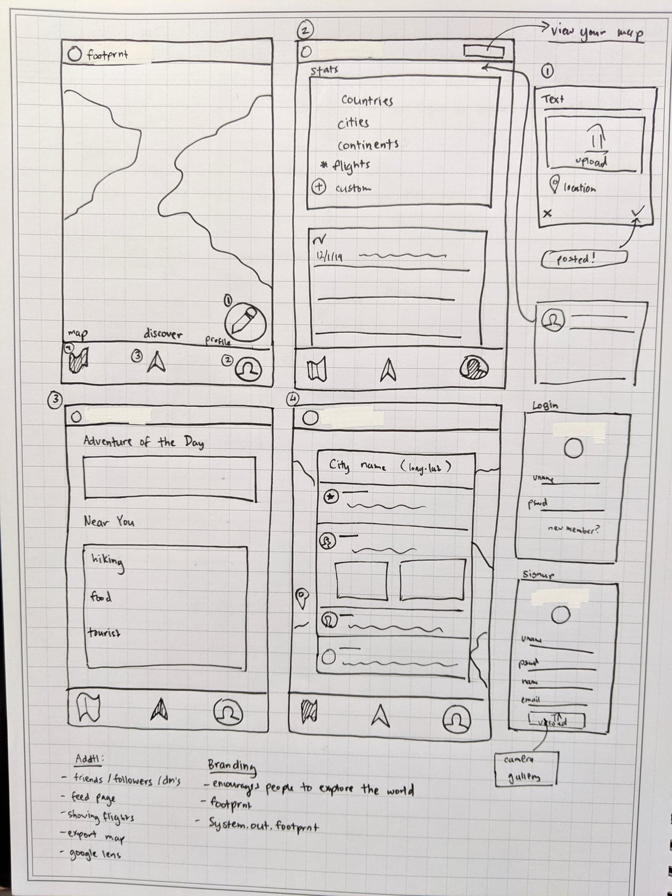

# footprnt
## 1. User Stories (Required and Optional)

**Required Must-have Stories**

 * News feed where users can see friends post (Home page). Add friend button
 * Map where users can see the places they've traveled (Swipe L or R from home page)
 * A profile page with user stats, export feature
 * A friend list, settings page etc.
 * Posting feature where users can add pictures/places they've been and share in news feed
 * Explore button on map which takes the users live location into account and lists fun things/activities to do in the area (another activity) - Or just an adventure of the day

**Optional Nice-to-have Stories**
 * From the list of activities to do in the area - users can sort them based on price, date, cateogory (business, etc). One idea is to use the event brite api which sorts this for you already https://www.eventbrite.com/platform/api
 * From the map, users have the option to toggle their visibility to other users (friends) and can see other users on the map as well by toggling button
 * Users have the option to click the camera button on the toolbar and can learn more information about buildings/art with their camera
 * Travel badges .. more cities = more badges. Or more unique places = cool badges.

## 2. Screen Archetypes

 * Newsfeed/Home Screen
   * Users can add friends
   * Fake buttons for inbox
   * Users can see friends posts
   * Users can add new posts
   * Navigate to map (swipe R or L) and settings/profile pg
 * Profile page
   * Users can see travel stats (how many cities/countries)
   * Users can navigate to friends list
   * Users can export map to share on social media stuff or in message
   * Users can navigate to settings
   * Users can change profile picture
 * Settings page
    * Users can change basic information here
* Friends list
    * Users can remove friends here and see all friends
* Map
    * Discover feature (floating button maybe?)
    * Users can navigate back to home
    * Users can see map of where they've been
* Explore Page
    * Users can get "an adventure of the day" or it will just be a large list of activities in their current location. Users can type in a new location as well and screen reloads.

## 3. Navigation

**Tab Navigation** (Tab to Screen)

 * Home
 * Inbox
 * Notifications
 * Discover
 * Profile Page
 * Settings

**Flow Navigation** (Screen to Screen)

 * Home/news feed
   * Discover
    * Nofications
    * Messages
    * Profile Pages
    * Settings
    * Posting a new post page (add)
 * Posting a new post
   * Home/News feed
   * Profile page
 * Profile Page
     * Home
     * Inbox
     * Notifacations
     * Discover
     * Settings
     * Friendlist
* Discover
    * Home/News feed
    * Inbox
    * Profile Page
    * Notfications
    * "Adventure Page"

### Wire frames / Rough Sketch

